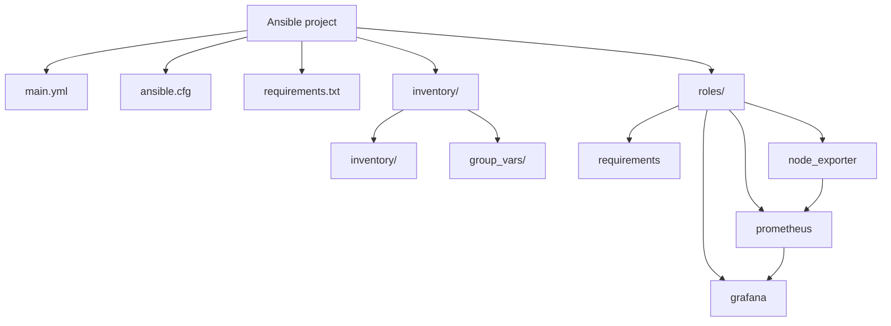

# Scenario 2

This repository provisions a small monitoring stack on the host defined in the monitoring inventory.

## Project structure



The playbook uses the inventory, group variables, and roles to configure the monitoring host.

## Playbook organization

[`main.yml`](./main.yml) contains two plays:

1. Checks SSH connectivity for all inventory hosts.
2. Deploys the monitoring stack to the `monitoring` group.

The monitoring roles run in this order:

1. `requirements`
2. `node_exporter`
3. `prometheus`
4. `grafana`

## Inventory and variables

The target host is configured in [`inventory/inventory/monitoring.yml`](./inventory/inventory/monitoring.yml).
Connection details such as `ansible_host` and `ansible_user` belong there.

Monitoring ports are defined in [`inventory/group_vars/monitoring.yml`](./inventory/group_vars/monitoring.yml):

- Prometheus: `9090`
- Grafana: `3000`
- Node Exporter: `9100`

## Roles

- **requirements** copies `requirements.txt` to the target host and installs it with `pip3`.
- **node_exporter** installs Node Exporter as a systemd service and exposes host metrics.
- **prometheus** installs Prometheus and configures it to scrape Prometheus and Node Exporter.
- **grafana** installs Grafana, configures Prometheus as its default datasource, and provisions a dashboard with CPU and memory panels.

Role defaults, tasks, handlers, and templates are kept inside each role directory.

## Ansible Vault

Encrypted variables are stored in [`inventory/group_vars/all/vault.yml`](./inventory/group_vars/all/vault.yml).
The file is protected with Ansible Vault and must remain encrypted in the repository.

Use a vault password file or prompt for the password when running the playbook:

```bash
ansible-playbook -i inventory main.yml --ask-vault-pass
```

To inspect or update the encrypted variables:

```bash
ansible-vault view inventory/group_vars/all/vault.yml
ansible-vault edit inventory/group_vars/all/vault.yml
```

Do not commit plaintext secrets or the vault password to the repository.

## Running the project

Create and activate a Python environment, then install the project dependencies:

```bash
python -m venv .venv
source .venv/bin/activate
pip install -r requirements.txt
```

Run the playbook from the repository root:

```bash
ansible-playbook -i inventory main.yml -b --ask-vault-pass
```
>The pass is `lab123`

grafana pass is `lab123`

# Challenges

## PyPI Connectivity Issue

Unable to connect to PyPI due to network restrictions. Configured `pip` to use the Runflare PyPI mirror:

```bash
pip config --user set global.index https://mirror-pypi.runflare.com/simple
pip config --user set global.index-url https://mirror-pypi.runflare.com/simple
pip config --user set global.trusted-host mirror-pypi.runflare.com
pip config --user set global.timeout 60
```

## Server Connection Issue

Due to server connectivity issues, I tested the setup on a local Vagrant environment first.

Configured the Vagrant private key:

```ini
private_key_file=~/.vagrant.d/insecure_private_key
```
After that I continued on the server 2 again.
